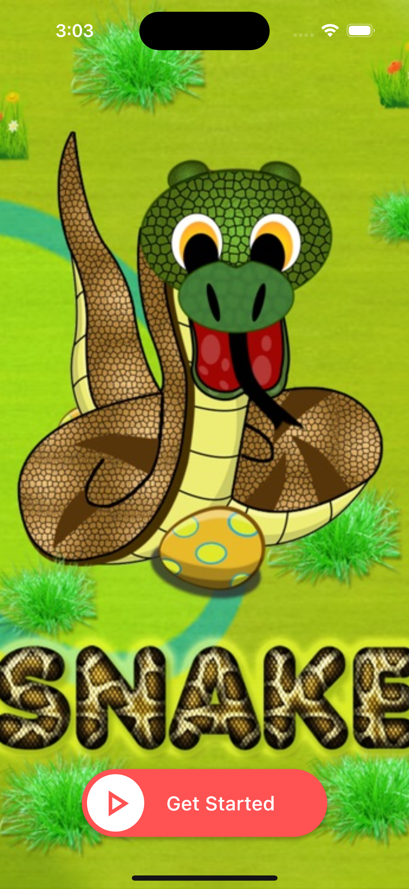
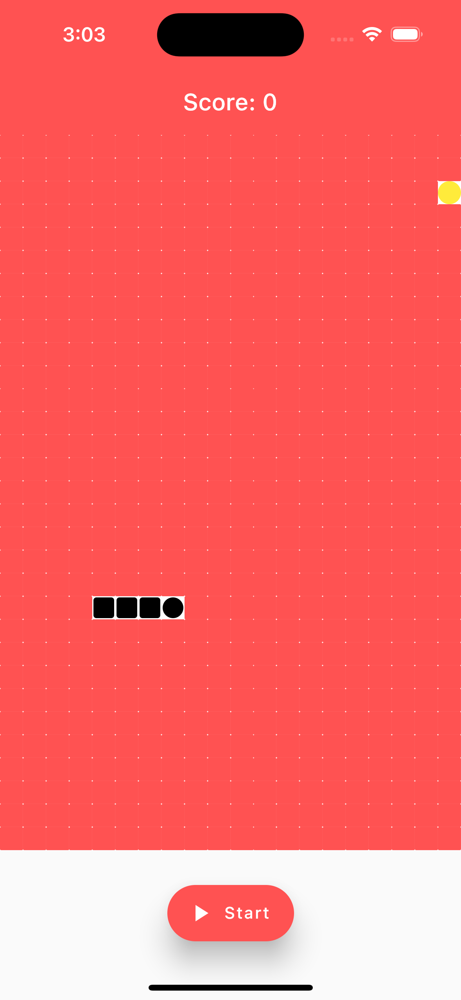
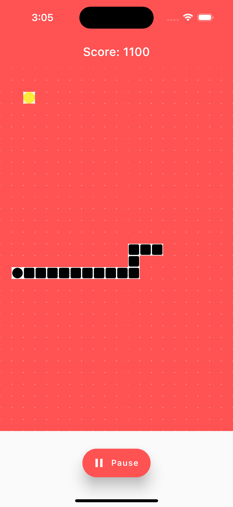
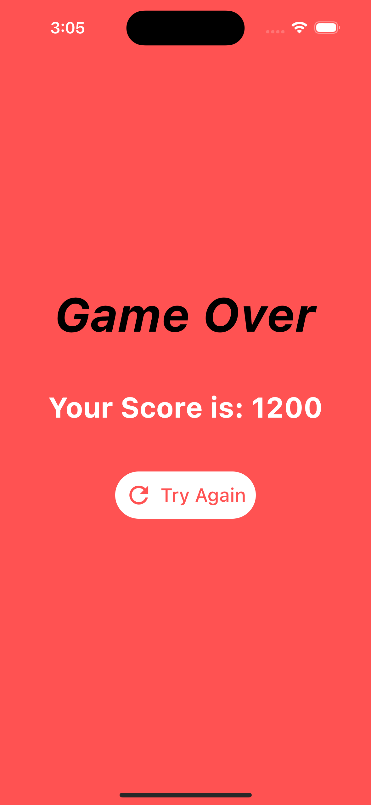

<!DOCTYPE html>
<html>
<body>
	<h1>Snake Game in Flutter</h1>
	
This is a classic Snake Game built with Flutter. The objective of the game is to control a snake that grows in length by eating food without hitting the walls or its own body.

  
  <h2>Installation</h2>
<ol>
	<li>
		
Clone this repository:

		<pre><code>git clone https://github.com/aryamanshrivastava/Flutter-SnakeGame.git</code></pre>
	</li>
  <li>
	
Navigate to the project directory:

	<pre><code>cd Flutter-SnakeGame</code></pre>
  </li>

  <li>
	
Install the dependencies:

	<pre><code>flutter pub get</code></pre>
  </li>

  <li>
	
Run the app:

	<pre><code>flutter run</code></pre>
  </li>
</ol>

<h2>Gameplay</h2>

To start the game, press the "Start" button on the main screen. Use the arrow keys to control the snake's movement: up, down, left, or right. The snake will move continuously in the direction of the last arrow key press. When the snake eats a piece of food, its length will increase by one unit and the score will increase by 10 points. The game ends when the snake collides with the walls or its own body. To restart the game, press the "Try Again" button on the game over screen.

<h2>Screenshots</h2>

<h2>Credits</h2>

This game was developed by <a href="https://github.com/aryamanshrivastava">Aryaman Shrivastava</a> for educational/learning purposes only. The assets used in this game are from <a href="https://opengameart.org/">OpenGameArt</a> and <a href="https://kenney.nl/">Kenney.nl</a>.

</body>
</html>
